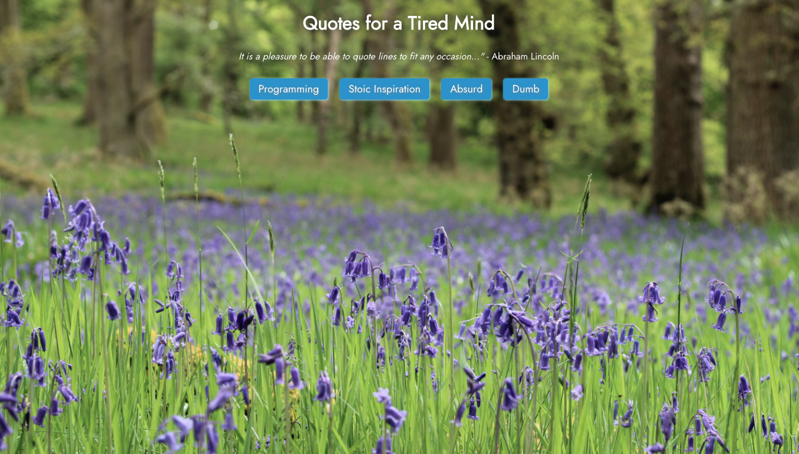
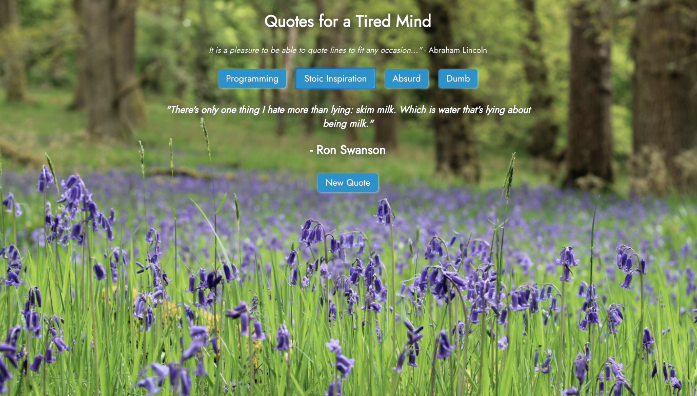
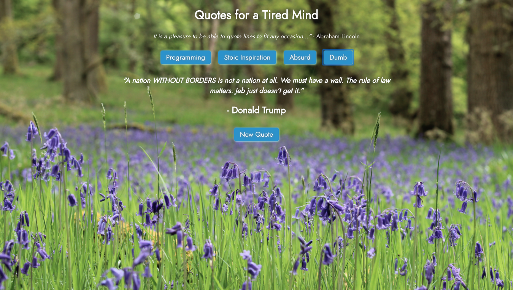

# Quotes to Distract a Tired Mind


### Brief
Your task is to create an application that makes a request to an API and displays the data.

### The App

A simple app that allows the user to pick from one of four categories of quotes and refresh each one independently. Intended as a pleasant distraction for an overworked brain.

## Start Screen



## Programming


## Stoic Inspiration



## Absurd


## Dumb




### Running Instructions

# vue_app

## Project setup
```
npm install
```

### Compiles and hot-reloads for development
```
npm run serve
```

### Compiles and minifies for production
```
npm run build
```

### Customize configuration
See [Configuration Reference](https://cli.vuejs.org/config/).
